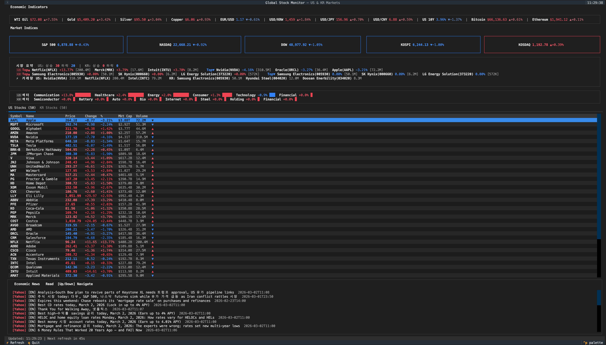
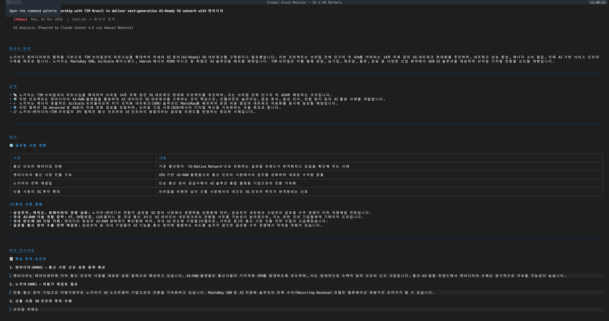
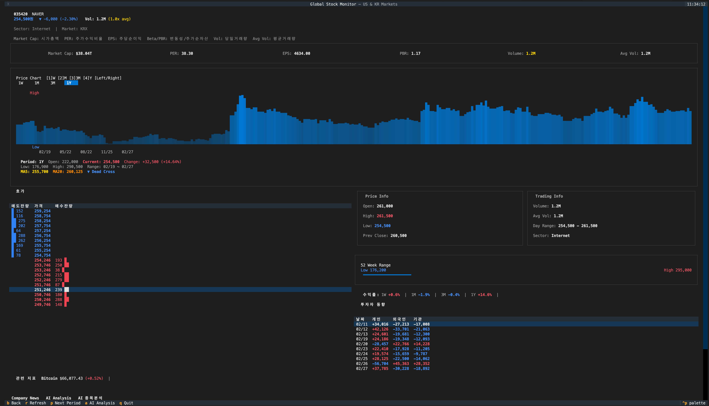
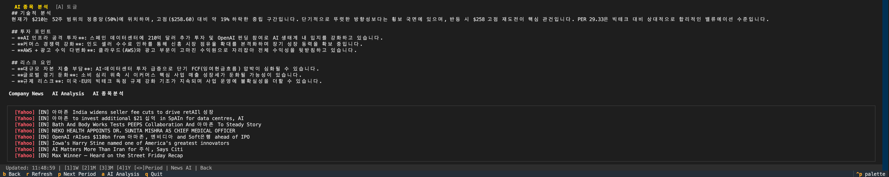

# Stock-on-TUI

> Textual 기반 실시간 글로벌 주식 모니터 TUI (Terminal User Interface) 앱

미국 50종목 + 한국 50종목의 시세, 차트, 호가, 투자자 동향, AI 분석을 터미널에서 한눈에 확인할 수 있습니다.

---

## Screenshots

### Dashboard — 시장 전체 현황
경제지표, 시장지수, 시장 요약(상승/하락/거래량 Top), 섹터 등락, 종목 테이블, 뉴스 피드를 한 화면에 표시합니다.



### Insight — 시장 요약 + 섹터 등락
US/KR 시장별 상승·하락 종목수, Top 상승/하락 종목(종목명+거래량), 거래량 리더, 섹터별 평균 등락률 바 차트를 제공합니다.



### Detail — 종목 상세 분석
차트(MA5/MA20 이동평균선 + 골든/데드크로스), 호가, 투자자 동향, 기간별 수익률, 관련 경제지표, AI 종목 분석을 제공합니다.



### AI Analysis — 뉴스 기사 AI 분석
AWS Bedrock Claude Sonnet을 통해 뉴스 기사 요약, 시장 영향 분석, 투자 인사이트, 관련 종목을 자동 도출합니다. 영어 기사는 한국어로 번역 후 분석합니다.



---

## Features

### 1. Dashboard (메인 화면)

| 기능 | 설명 |
|------|------|
| **경제지표 바** | WTI, Gold, Silver, Copper, EUR/USD, USD/KRW, USD/JPY, USD/CNY, US 10Y, Bitcoin, Ethereum — 11개 글로벌 지표 실시간 표시 |
| **시장 지수** | S&P 500, NASDAQ, DOW (미국) / KOSPI, KOSDAQ (한국) — 카드형 위젯으로 현재값·등락률 표시 |
| **시장 요약** | US/KR 상승·하락 종목수 집계, Top 3 상승·하락 종목 (종목명+심볼+등락률+거래량), 거래량 Top 3 |
| **섹터 등락** | US/KR 시장별 섹터 평균 등락률을 막대 그래프로 시각화 (Technology, Financial, Energy 등) |
| **주식 테이블** | US 50종목 / KR 50종목 탭 전환, Symbol·Name·Price·Change·%·Mkt Cap·Volume 컬럼 |
| **뉴스 피드** | Yahoo Finance + 한국경제 + 매일경제 RSS 뉴스 실시간 수집 |
| **자동 갱신** | 주가 45초, 뉴스 120초 주기 자동 갱신 |

### 2. Detail (종목 상세 화면)

| 기능 | 설명 |
|------|------|
| **가격 헤더** | 현재가, 등락률, 거래량 + 평균 대비 배율 (1.5x 이상 빨강, 1.0x 이상 노랑) |
| **핵심 지표** | Market Cap(시가총액), PER(주가수익비율), EPS(주당순이익), Beta/PBR(변동성/주가순자산), Vol(당일거래량), Avg Vol(평균거래량) |
| **차트** | 1W/1M/3M/1Y 기간별 Sparkline 차트 + MA5/MA20 이동평균선 + 골든크로스/데드크로스 신호 |
| **호가** | 매도 10단계 (파란색) + 매수 10단계 (빨간색) 호가창 |
| **투자자 동향** | 개인/외국인/기관 최근 10일간 순매수·순매도 추이 |
| **기간별 수익률** | 1W, 1M, 3M, 1Y 기간별 수익률 계산 표시 |
| **관련 지표** | 종목 섹터 기반 관련 경제지표 자동 매핑 (예: Energy → WTI Oil, Copper) |
| **AI 종목 분석** | `A` 키로 AWS Bedrock Claude 기반 기술적 분석·투자 포인트·리스크 요인 3줄 요약 |

### 3. Article (뉴스 AI 분석 화면)

| 기능 | 설명 |
|------|------|
| **기사 전문** | 뉴스 URL에서 기사 본문 자동 추출 |
| **AI 분석** | Claude Sonnet 4.6을 통한 요약·분석·투자 인사이트·관련 종목 도출 |
| **영한 번역** | 영어 기사는 자동으로 한국어 번역 + 분석 제공 |

---

## Getting Started

### 지원 환경
- **Amazon Linux 2023** (EC2)
- **macOS** (Homebrew 기반)
- Python 3.11+

### 설치

```bash
git clone https://github.com/whchoi98/stock-on-tui.git
cd stock-on-tui
chmod +x install.sh
./install.sh
```

설치 과정에서 다음을 자동으로 처리합니다:
1. OS 감지 (Amazon Linux / macOS)
2. Python 3.11 + 시스템 의존성 설치
3. 가상환경 생성 + pip 패키지 설치
4. AWS Bedrock credentials 입력 (선택사항)
5. `run.sh` 실행 스크립트 생성

> **AWS Bedrock 미설정 시**: AI 종목 분석, 뉴스 AI 분석, 영한 번역 기능이 비활성화됩니다. 나머지 모든 기능(시세, 차트, 호가, 투자자 동향 등)은 정상 동작합니다.

### 실행

```bash
./run.sh
```

### Bedrock 나중에 설정하기

```bash
# 방법 1: install.sh 재실행
./install.sh

# 방법 2: .env 파일 직접 수정
vi .env
# AWS_ACCESS_KEY_ID=your-key
# AWS_SECRET_ACCESS_KEY=your-secret
# AWS_DEFAULT_REGION=us-east-1
```

---

## Key Bindings

### Dashboard
| Key | Action | 설명 |
|-----|--------|------|
| `R` | Refresh | 전체 데이터 새로고침 |
| `Tab` | Next Section | 다음 섹션으로 포커스 이동 |
| `Shift+Tab` | Prev Section | 이전 섹션으로 포커스 이동 |
| `Enter` / Click | Select Stock | 종목 상세 화면으로 이동 |
| `Q` | Quit | 앱 종료 |

### Detail (종목 상세)
| Key | Action | 설명 |
|-----|--------|------|
| `1` `2` `3` `4` | Period | 차트 기간 전환 (1W/1M/3M/1Y) |
| `Left` / `Right` | Cycle Period | 차트 기간 순환 전환 |
| `P` | Next Period | 다음 차트 기간 |
| `A` | AI Analysis | AI 종목 분석 토글 (Bedrock 필요) |
| `Enter` | News AI | 선택한 뉴스 기사 AI 분석 |
| `R` | Refresh | 종목 데이터 새로고침 |
| `B` / `Escape` | Back | 대시보드로 복귀 |

---

## Architecture

### Screen Flow
```
┌─────────────────┐     Row Click      ┌─────────────────┐    Enter on News    ┌─────────────────┐
│  DashboardScreen │ ─────────────────► │  DetailScreen    │ ──────────────────► │  ArticleScreen   │
│                  │                    │                  │                     │                  │
│ • IndicatorBar   │     B / Escape     │ • RichChart      │     B / Escape      │ • AI Analysis    │
│ • MarketCards    │ ◄───────────────── │ • OrderBook      │ ◄────────────────── │ • Markdown View  │
│ • MarketSummary  │                    │ • InvestorTrends │                     └─────────────────┘
│ • SectorBar      │                    │ • PeriodReturns  │
│ • StockTable     │                    │ • RelatedIndicators
│ • NewsFeed       │                    │ • AI Analysis    │
└─────────────────┘                    └─────────────────┘
```

### Data Flow (Dashboard 4-Wave Loading)
```
on_mount()
  └─ load_all_data()
       ├─ Wave 1: US/KR Indices        (빠름, 즉시 표시)
       ├─ Wave 2: Economic Indicators   (즉시 표시)
       ├─ Wave 3: US/KR Stock Quotes    (병렬 로딩 → 시장 요약 + 섹터 바 갱신)
       └─ Wave 4: Market Caps           (백그라운드, 테이블 업데이트)
  └─ load_news()                        (별도 그룹, 120초 주기)
```

### Project Structure
```
stock-on-tui/
├── app.py                  # 앱 엔트리포인트 / App entry point
├── config.py               # 종목·섹터·지표·RSS 설정 / Stocks, sectors, indicators, RSS config
├── install.sh              # 설치 스크립트 / Installation script
├── run.sh                  # 실행 스크립트 / Run script
├── requirements.txt        # Python 의존성 / Python dependencies
│
├── models/
│   └── stock.py            # 데이터 모델 (StockQuote, StockDetail, MarketIndex, EconomicIndicator)
│
├── screens/
│   ├── dashboard.py        # 메인 대시보드 화면 / Main dashboard screen
│   ├── detail.py           # 종목 상세 화면 / Stock detail screen
│   └── article.py          # 뉴스 AI 분석 화면 / Article AI analysis screen
│
├── components/
│   ├── market_summary.py   # 시장 요약 위젯 / Market summary widget
│   ├── sector_bar.py       # 섹터 등락 바 / Sector performance bar
│   ├── rich_chart.py       # 차트 + MA / Price chart with moving averages
│   ├── stock_table.py      # 종목 테이블 / Stock data table
│   ├── market_card.py      # 지수 카드 / Market index card
│   ├── indicators.py       # 경제지표 바 / Economic indicator bar
│   └── news_feed.py        # 뉴스 피드 / News feed
│
├── services/
│   ├── us_stocks.py        # 미국 주식 데이터 (yfinance) / US stock data
│   ├── kr_stocks.py        # 한국 주식 데이터 (pykrx) / KR stock data
│   ├── indicators.py       # 경제지표 데이터 (yfinance) / Economic indicators
│   ├── news.py             # RSS 뉴스 + 영한 번역 / RSS news + translation
│   ├── stock_detail_data.py # 호가·투자자 시뮬레이션 / Order book & investor simulation
│   └── bedrock.py          # AWS Bedrock AI 서비스 / AI analysis service
│
├── styles/
│   └── app.tcss            # Textual CSS 테마 / Dark theme stylesheet
│
├── screenshots/            # 스크린샷 / Screenshots
├── docs/                   # 아키텍처·결정·런북 / Architecture, decisions, runbooks
├── tools/                  # 스크립트·프롬프트 / Scripts and prompts
└── .claude/                # Claude Code 설정·스킬 / Claude Code settings and skills
```

---

## Dependencies

| Package | Version | 용도 |
|---------|---------|------|
| `textual` | >= 0.40.0 | TUI 프레임워크 (위젯, 레이아웃, 이벤트) |
| `yfinance` | >= 0.2.31 | 미국 주식·지수·경제지표 데이터 |
| `pykrx` | >= 1.0.45 | 한국 주식·지수 데이터 (KRX) |
| `httpx` | >= 0.25.0 | HTTP 클라이언트 (RSS, 웹 스크래핑) |
| `boto3` | >= 1.28.0 | AWS Bedrock AI (선택사항) |

---

## Troubleshooting

| 증상 | 원인 | 해결 |
|------|------|------|
| 주식 데이터 안 나옴 | 네트워크 또는 yfinance 장애 | `R` 키로 새로고침, 인터넷 연결 확인 |
| KR 주식 0원 표시 | KRX 장 마감 후 이전 종가 반환 | 정상 동작 — 다음 거래일 장중 갱신 |
| AI 분석 안 됨 | AWS Bedrock 미설정 | `.env` 파일에 AWS credentials 추가 |
| PER/EPS 표시 지연 | yfinance rate limit | 자동 retry (5s→10s→15s backoff) |
| 터미널 깨짐 | 유니코드 미지원 터미널 | iTerm2, Windows Terminal, Kitty 사용 |

---

## License

MIT
